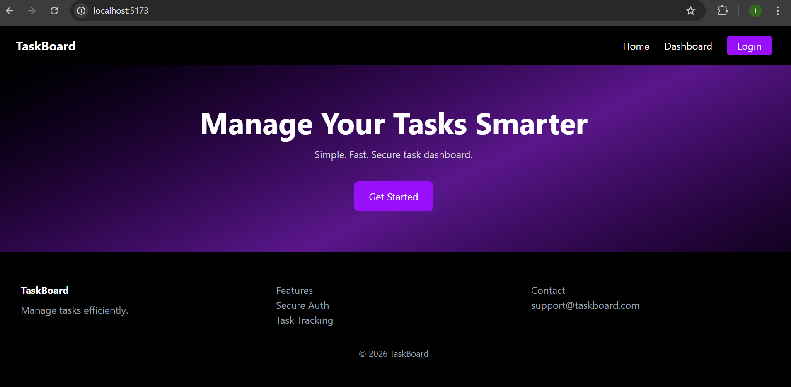
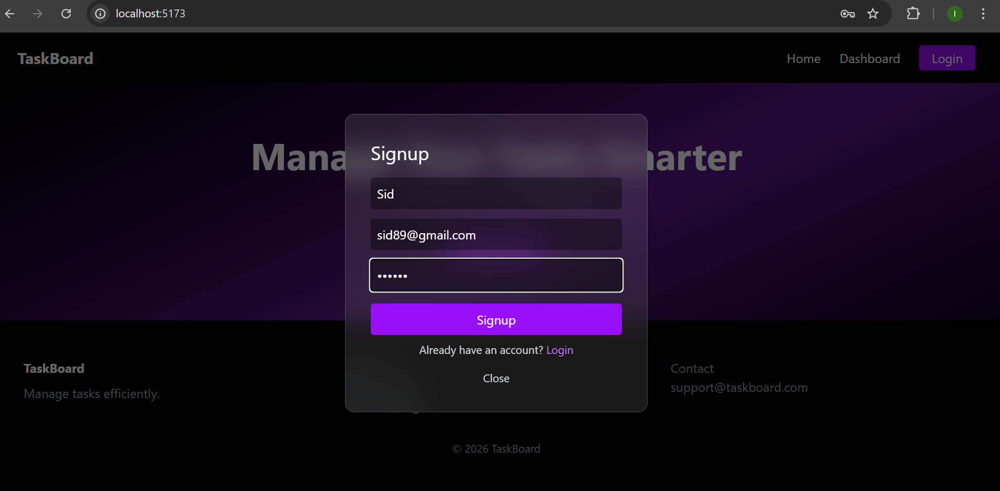
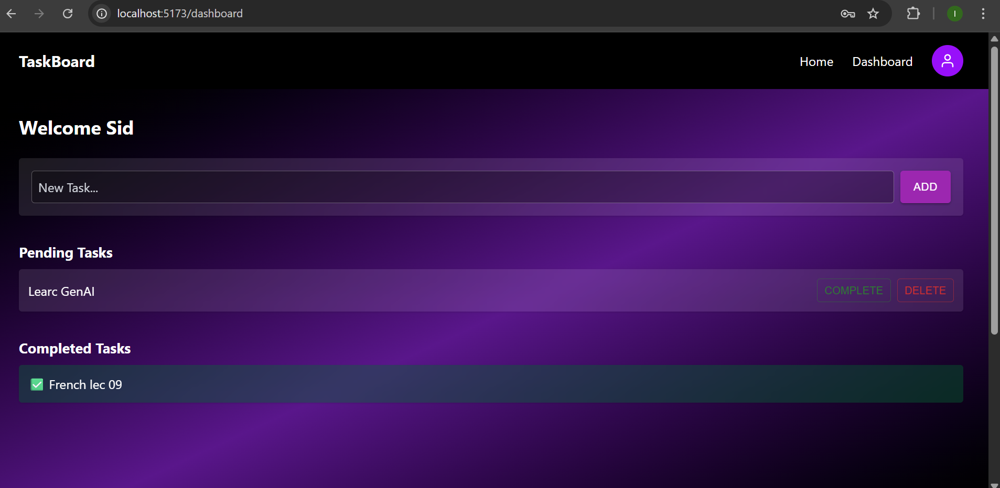

# TaskBoard

TaskBoard is a full-stack task management web platform. Users can signup/login, manage tasks (add, complete, delete), update their profile and delete their account. It features a modern UI with glassmorphic modals and a black-purple gradient theme.

---

## Tech Stack

**Frontend:**
- React(Vite)
- Tailwind CSS
- Material UI
- React Icons
- Axios
- React Router DOM

**Backend:**
- Node.js
- Express.js
- MongoDB + Mongoose
- JWT Authentication
- CORS, dotenv

---

## Features

- Landing page with black-purple gradient
- Glassmorphic Login/Signup modal with validation
- Dashboard with pending and completed tasks
- Complete, delete and add tasks
- User avatar dropdown with Profile modal
- Edit user profile and delete account
- Protected routes (Dashboard accessible only after login)
- Logout functionality clears auth and redirects to home

---

## Setup Instructions

### 1. Clone the repository

```bash
git clone https://github.com/Isha12D/TaskBoard
cd taskboard
```

### 2️⃣ Backend Setup
```bash
cd backend
npm install
```

- Create `.env` file
```bash
PORT=5000
your_mongodb_connection_string
JWT_SECRET=your_secret_key
```

- Run Backend Server
```bash
npm run start
```

- Backend will start at:
```
http://localhost:5000
```

### 3️⃣ Frontend Setup
```bash
cd frontend
npm install
npm run dev
```
- Frontend will run at:
```
http://localhost:5173
```

---

## MongoDB Seed / Demo Credentials (optional)

You can create a few demo users directly via the signup modal:

| Name       | Email             | Password |
|------------|-----------------|----------|
| Ananya  | ananya45@gmail.com   | ananya45@ |
| Poonam  | poonam56@gmail.com    | poonam56@ |


---

## API Endpoints

### Auth
| Method | Route                | Description       |
|--------|--------------------|-----------------|
| POST   | /api/v1/auth/signup | Create a new user |
| POST   | /api/v1/auth/login  | Login user       |

### User
| Method | Route                | Description          |
|--------|--------------------|--------------------|
| GET    | /api/v1/me          | Get current user info |
| PATCH  | /api/v1/me/update   | Update user profile   |
| DELETE | /api/v1/me/delete   | Delete user account   |

### Tasks
| Method | Route                          | Description             |
|--------|-------------------------------|------------------------|
| GET    | /api/v1/tasks                  | Get all tasks          |
| GET    | /api/v1/tasks/completed/all    | Get completed tasks    |
| POST   | /api/v1/tasks                  | Create a new task      |
| PATCH  | /api/v1/tasks/:id/complete     | Mark task as completed |
| DELETE | /api/v1/tasks/:id              | Delete task            |


---

##  Screenshots 
- **Landing Page:** bLack/ purple theme

- **AuthModal:** Glassmorphic login/signup  

- **Dashboard:** Pending & completed tasks 
 

---

## 🚀 Scaling for Production

To scale this application for production, consider the following:

1. **Deployment**: Use platforms like Vercel/Netlify for frontend and Render/Heroku/AWS EC2 for backend.  
2. **CORS & Security**: Configure proper CORS policies, HTTPS, rate limiting and JWT token expiration.  
3. **Environment Management**: Use `.env` files or cloud secrets management for sensitive keys and configs.  
4. **Database Optimization**: Index frequently queried fields (like `user`, `completed`) to improve query performance.  
5. **Caching**: Implement caching layers (Redis or in-memory) for repeated queries, e.g., fetching tasks.  
6. **Load Balancing**: Use load balancers and horizontal scaling for high traffic scenarios.  
7. **Logging & Monitoring**: Integrate logging (Winston/Logstash) and monitoring (Prometheus, Grafana) to track errors and performance.  
8. **CDN**: Serve static assets via a CDN to reduce latency.  
9. **Backup & Recovery**: Regular DB backups and disaster recovery strategies.  
10. **Testing & CI/CD**: Automated tests and pipelines for continuous integration and delivery.  

This ensures performance, reliability and maintainability when the app grows.

## 🖊 Author

– Isha Doifode

---

